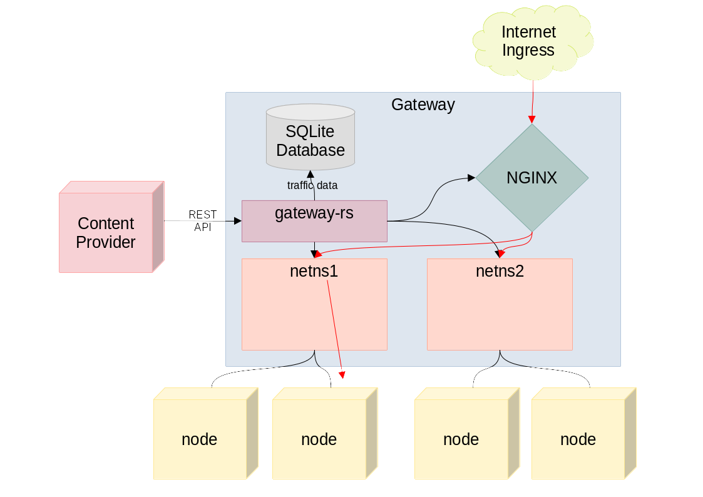

# Gateway

This is a daemon that controls gateway servers. Gateway servers are servers that
fulfil three major purposes: facilitating connectivity between nodes,
allowing ingress traffic from the internet to reach the nodes, and monitoring
the state of the interfaces and traffic that occurs for accounting purposes.



To facilitate network connectivity between nodes, we create
[WireGuard][wireguard] networks
for the nodes to communicate with one another. This is done by creating a Linux
network namespace per group of nodes that want to communicate, and within that
network namespace, offering a WireGuard interface. This means that all groups
of nodes that a single gateway hosts is fully isolated.

To allow ingress web traffic to reach the nodes, the gateway servers run
HTTP and HTTPS proxies. HTTP traffic is proxied using a reverse proxy setup,
similar to what is commonly achieved with [NGINX][nginx]. To proxy HTTPS traffic, we
rely on the TLS SNI data: when a client makes a connection, it indicates
to the server which hostname it is connecting to. This is done to allow the
server to use the correct certificate if it is hosting multiple sites.

Instead, we use that connection to then forward the entire encrypted stream
to the respective WireGuard network namespace, achieving end-to-end encryption.

# API

The gateway offers a REST API that allows for configuring it. The API is
authenticated with a static token (for now, we will add another authentication
mechanism down the road).

## GET /api/v1/config.json

Performing a GET request against this endpoint returns the currently active
configuration as a JSON document.

The configuration does not change while the system is running.

## POST /api/v1/config.json

Posting a configuration as a JSON document to this endpoint applies that
configuration. The configuration represents the entire visible state. 

To test out applying a configuration, there is a sample configuration
at [test/state.json](test/state.json) and a bash script that can be used
to apply it.

	./test/apply.sh test/state.json

## GET /api/v1/status.json

This endpoint returns a JSON file describing the current status, including
the connected clients. This changes and can be polled to get visibility into
what is going on. This endpoint also returns any errors or degraded state
info.

## GET /api/v1/traffic.json?since=$timestamp

This endpoint returns all traffic data that occured since the supplied timestamp.
Note that traffic information may be deleted after 24 hours.

# State

The state is encoded as a JSON document. An example state is in
[test/state.json](test/state.json), looking like this:

```json
{
    "12312": {
        "private_key": "2PGDeXYynfKqJH4k0sUgKeRKpL4DUGGLTKnPjKViZFk=",
        "address": ["10.0.0.1/16"],
        "peers": [
            {
                "public_key": "jNBIJrDn1EuvZFmdyTYxobc0lixvWqU3b9mBDKxtWRw=",
                "preshared_key": "4HtDIu03g/UVHHCsKXXRSj7rvA4DidAJ2ryqvCqeWWg=",
                "endpoint": "170.24.12.42:41213",
                "allowed_ips": ["10.0.0.1/32"]
            },
            {
                "public_key": "jNBIJrDn1EuvZFmdyTYxobc0lixvWqU3b9mBDKxtWRw=",
                "preshared_key": "4HtDIu03g/UVHHCsKXXRSj7rvA4DidAJ2ryqvCqeWWg=",
                "endpoint": "170.24.12.42:41213",
                "allowed_ips": ["10.0.0.1/32"]
            },
            {
                "public_key": "jNBIJrDn1EuvZFmdyTYxobc0lixvWqU3b9mBDKxtWRw=",
                "preshared_key": "4HtDIu03g/UVHHCsKXXRSj7rvA4DidAJ2ryqvCqeWWg=",
                "endpoint": "170.24.12.42:41213",
                "allowed_ips": ["10.0.0.1/32"]
            }
        ],
        "proxy": {
            "gitlab.mydomain.com": ["10.0.0.1:8000", "10.0.0.2:5000"],
            "chat.mydomain.com": ["10.0.0.2:7000"]
        }
    }
}
```

The state is essentially a map of ports (which represent the public-facing
WireGuard UDP ports) to network configurations. Every network has a private
key, an address, as well as a bunch of peers. Additionally, networks can have
proxy configurations which forward HTTP and HTTPS traffic from the gateway's
public internet connection to inside the WireGuard networks.

The reason that it is implemented this way (as a map of ports to network
configurations) is that this way, we get a type-level guarantee that a
state cannot represent illegal states (such as having two networks with the
same listen port). We try to ensure that illegal states are not even
representable.

# Implementation

The code is written in [Rust][rust], using [Rocket][rocket] as the
HTTP library, [Tokio][tokio] for the asynchronous runtime and
[SQLite][sqlite] for the database where traffic data is logged.

## Compilation

To compile this code, make sure that you have a nightly version of Rust. If not,
install one with [Rustup][rustup], by running the installer and then running

    rustup toolchain install nightly

Once rustup and the nightly toolchain is installed, you can let rustup know
that it should use that toolchain for this repository by running

    rustup override set nightly

Once that is working, build the code for deployment by running

    cargo build --release

The resulting static binary will be available in `target/release/gateway` after
a successful build, which can be deployed to any machine. The binary is
self-contained and needs no additional runtime data.

## Dependencies

Install these with APT or similar.

- wireguard-tools
- iptables
- iproute2
- nginx

## Running

To run it, simply launch the executable with root privileges on a suitable
Linux machine. To secure it, use the `--token` option to set a secret token
that needs to be present in API calls. To allow it to record traffic stats,
use the `--database` option with a path to a file that will be used to store
traffic data. If no database path is set, traffic data will be stored in RAM
and will not persist after restarts.

Some configuration options can be passed as environment variables:

- `ROCKET_PORT` controls which port the HTTP server listens to, by default 8000.
- `ROCKET_ADDRESS` controls which address the server listens to, by default 127.0.0.1.
- `RUST_LOG` controls how much logging information is output, set to `info` for
  more detail. This can also be used to enable logging only for specific modules
  or functions, for example setting it to `rocket=error,gateway=info` disables
  verbose Rocket output, but still allows all logs from this crate's code.

# License

*TODO.*

[sqlite]: https://sqlite.org/
[rust]: https://rust-lang.org/
[wireguard]: https://wireguard.com/
[nginx]: https://nginx.org/
[tokio]: https://tokio.rs/
[rocket]: https://rocket.rs/
[rustup]: https://rustup.rs/
